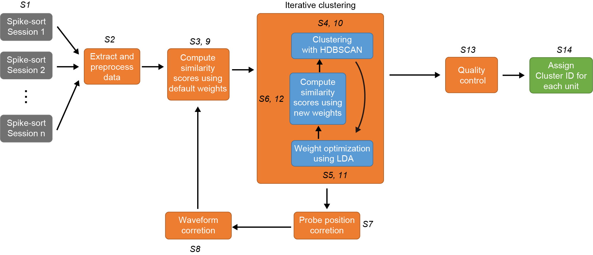

Overview
================

Kilomatch is a MATLAB toolbox for tracking the neurons across days with high-density probes (Neuropixels).

Check out the Python version of Kilomatch `here <https://github.com/jiumao2/pyKilomatch>`_!  

Pipeline
----------------

Kilomatch takes the well spike-sorted data as inputs and assigns a unique cluster ID for each unit as outputs. Kilomatch does not require user-defined "threshold" to filter for the good matches, and thus provides a fully automatic way to track the same neurons across days to months. 

Following spike sorting of each session (1, 2, ..., n) independently, each presumed single-unit was assigned a unique ID (k=1,2,,K; Step 1 or S1 for short). Features for similarity analysis were extracted from each unit (S2), including spike waveforms across a designated channel set (typically the entire recording shank), autocorrelograms (ACGs), and peri-event time histograms (PETHs) or peri-stimulus time histograms (PSTHs) reflecting functional properties (optitional). Similarity scores between unit pairs were computed using default weights (1/3 for each feature, S3), and nominal distances were calculated to quantify pairwise similarity. Using the distance, density-based clustering identified matched units hypothesized to originate from the same neuron (S4). Linear discriminant analysis (LDA) was then applied to derive weights maximizing discrimination between matched and unmatched pairs (S5), yielding updated similarity scores (S6). Clustering was iterated until weights stabilized and clustering results converged. Using spatial information from matched pairs, relative probe movement across sessions was inferred (S7), and spike waveforms were remapped to probe recording sites, correcting for movement (S8). With updated waveforms and optimized weights, similarity scores were recomputed, and clustering was repeated (S9-S11). A quality control step (S12) removed pairs within clusters failing LDA-derived similarity criteria. Clusters were then assigned IDs representing groups of units recorded across multiple sessions (2 to n) hypothesized to originate from the same neuron. Notably, the procedure required no user intervention: clustering was unsupervised, and LDA, while supervised, relied on clustering outcomes.

The pipeline contains 2 main loops: motion correction loop and clustering loop. The loop is designed to optimized the estimated probe motion, feature weights, and clustering results in a alternative manner. Next, we will go through the two loops in detail.

Motion correction loop
-------------------------
A major challenge in both spike sorting and cross-session neuron tracking is the probe motion relative to the brain, which alters waveform amplitudes and affects neuron detectability acorss channels. 

It is the main loop of Kilomatch, which iteratively estimates the probe motion, remaps the spike waveforms to the new probe locations, and updates the clustering results. 

To learn more about the motion correction, please refer to the :doc:`Motion correction <Motion_correction>` section.

Clustering loop
-------------------------
This loop is designed to optimize the clustering results by iteratively updating the similarity scores and clustering results. 

To learn more about the motion correction, please refer to the :doc:`Clustering <Clustering>` section.

