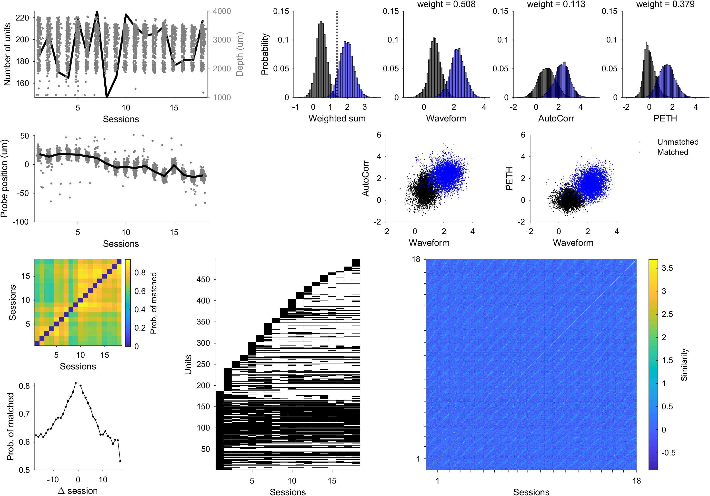
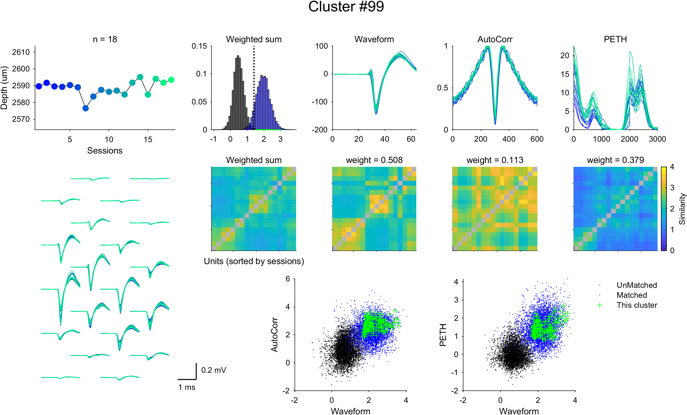

Tutorials
================

This tutorial provides a step-by-step guide on how to use the Kilomatch package for tracking neurons across sessions. It is designed to help you prepare your data and run the code effectively. You should install Kilomatch correctly before proceeding with this tutorial. If you haven't installed Kilomatch yet, please refer to the :doc:`Installation <Installation>` section.

.. _prepare_the_data_label:

Prepare the data
-----------------------

To use Kilomatch, you need to prepare your data in a specific format. The data should be an 1 x n struct array named ``spikeInfo`` with the following fields:

=================  =============================            ==================
Field name         Type                                     Explanation  
=================  =============================            ==================
``SessionIndex``   1 x 1 int                                indicating the session. It should start from 1 and be coninuous without any gaps.
``SpikeTimes``     1 x n double                             spike times in milliseconds
``Waveform``       n_channel x n_sample double              mean waveform in uV
``Xcoords``        n_channel x 1 double                     x coordinates of each channel
``Ycoords``        n_channel x 1 double                     y coordinates (depth) of each channel
``Kcoords``        n_channel x 1 double                     shank index of each channel (for multi-shank probes)
``PETH``           1 x n double                             peri-event time histogram (optional)
=================  =============================            ==================

An example of the data structure is shown below:

.. code-block:: matlab

    >> spikeInfo

    spikeInfo = 

    1x3479 struct array with fields:

        RatName
        Session
        SessionIndex
        Unit
        SpikeTimes
        Waveform
        Xcoords
        Ycoords
        Kcoords
        PETH
    
    >> spikeInfo(1)

    ans = 

    struct with fields:

            RatName: 'Michael'
            Session: '20240613'
        SessionIndex: 1
                Unit: 16
        SpikeTimes: [113.5000 166.6000 185.4000 196.3333 210.5667 231.2667 268.8667 300.3333 442.6000 534.2333 576.3333 … ]
            Waveform: [283x64 double]
            Xcoords: [283x1 double]
            Ycoords: [283x1 double]
            Kcoords: [283x1 double]
                PETH: [19.7457 19.7650 19.7651 19.7651 19.7649 19.7553 19.7637 19.7540 19.7618 19.7783 19.7778 19.7771 19.7762 … ]

Note that it have ``RatName``, ``Session``, and ``Unit`` fields, which are not used in Kilomatch but useful to identify the units.

- Copy the ``settings.json`` and ``mainKilomatch.m`` (for single shank) or ``mainKilomatchMultiShank.m`` (for multi shanks) files from the Kilomatch package to your data folder. It can be like:

.. code-block::

    your_data_folder/
    ├── mainKilomatch.m or mainKilomatchMultiShank.m
    ├── settings.json
    └── spikeInfo.mat

Edit the settings
-----------------------

To make Kilomatch work, you need to edit the ``settings.json`` file in your data folder. At least, you need to specify the following fields:

.. code-block:: json

    {
        "path_to_data": ".\\spikeInfo.mat", // path to spikeInfo.mat
        "output_folder": ".\\kilomatchOutput", // output folder
        "path_to_python": "path_to_anaconda\\anaconda3\\envs\\hdbscan\\python.exe", // path to python (3.9+) which has hdbscan installed
    }

If you don't want to use PETH feature, you should remove it in the ``motionEstimation`` part and ``clustering`` part. Here is what it looks like after editing:

.. code-block:: json

    // parameters for motion estimation
    "motionEstimation":{
        "max_distance": 100, // um. Unit pairs with distance larger than this value in Y direction will not be included for motion estimation
        "features": [
            ["Waveform", "AutoCorr"],
            ["Waveform", "AutoCorr"]
        ] // features used for motion estimation each iteration. Choose from "Waveform", "AutoCorr", "ISI", "PETH"
    },

and 

.. code-block:: json

    // parameters for clustering
    "clustering":{
        "max_distance": 100, // um. Unit pairs with distance larger than this value in Y direction will be considered as different clusters
        "features": ["Waveform", "AutoCorr"], // features used for motion estimation. Choose from "Waveform", "AutoCorr", "ISI", "PETH"
        "n_iter": 10 // number of iterations for the clustering algorithm
    },

Also, the ``mainKilomatch.m`` or ``mainKilomatchMultiShank.m`` file should be edited to specify the path to the Kilomatch package:

.. code-block:: matlab

    % Set the path to Kilomatch and settings
    path_kilomatch = '.\Kilomatch'; % The path where Kilomatch is installed
    path_settings = '.\settings.json'; % Please make sure the settings in the file are accurate

To learn more about the settings, please refer to the :doc:`Change default settings <Change_default_settings>` section. The optimized settings can help you get better tracking results!

Run the code
-----------------------

Run ``mainKilomatch.m`` or ``mainKilomatchMultiShank.m``. Hopefully, you will get the tracking results in the output folder specified in the ``settings.json`` file. It can be like:

.. code-block::

    your_data_folder/
    ├── mainKilomatch.m or mainKilomatchMultiShank.m
    ├── settings.json
    ├── spikeInfo.mat
    └── kilomatchOutput/
        ├── spikeInfo.mat
        ├── Output.mat
        ├── Waveforms.mat
        ├── resultIter.mat
        ├── Motion.mat
        ├── ClusterIndices.npy
        ├── DistanceMatrix.npy
        ├── LinkageMatrix.npy
        ├── HDBSCAN_settings.json
        └── Figures/
            └── Overview.png

.. _visualize_the_results_label:

Visualize the results
-----------------------

After running the code, you can visualize the results in the ``Figures/Overview.png`` file as shown above. Or you can re-generate the figure by running the following code in MATLAB:

.. code-block:: matlab

    overviewResults(user_settings, Output);

The figure shows the overview of the Kilomatch results, including the unit number / depth across sessions, the estimated probe motion, the similarity score distribution for different features and their weights, the matched probability between sessions, and presence of unique neurons across sessions, and the similarity matrix. The quality of tracking can be easily assessed by reading the figure.

Then, you may want to look into certain clusters. You can run the following code to visualize a cluster:

.. code-block:: matlab

    load kilomatchOutput/Output.mat; % load the output file
    load kilomatchOutput/spikeInfo.mat; % load the spikeInfo file
    load kilomatchOutput/Waveforms.mat; % load the waveforms file
    
    cluster_id = 1; % specify the cluster ID you want to visualize

    visualizeCluster(Output, cluster_id, spikeInfo, waveforms_corrected, Output.Params)

This will generate a figure like the one above, showing the corrected depth, corrected waveforms, autocorrelograms, and PETHs of the units in the specified cluster, with color-coded by session. The similarity between the units in the cluster is also shown. This figure will be saved to ``Figures/Clusters/Cluster<cluster_id>.png``. 

.. _output_label:

Understand the output
-----------------------

With some intermediate files, the main output file is located in ``kilomatchOutput/Output.mat``, which contains the following fields:

===========================     =============================               =================
Field name                      Type                                        Explanation  
===========================     =============================               =================
``RunTime``                     1 x 1 double                                total run time in seconds
``DateTime``                    datetime string                             date and time when the code is run
``NumUnits``                    1 x 1 int                                   number of units included in the analysis
``NumSession``                  1 x 1 int                                   number of sessions included in the analysis
``NumClusters``                 1 x 1 int                                   number of clusters found (each cluster has at least 2 units)
``Sessions``                    1 x n_unit int                              session index for each unit
``Params``                      1 x 1 struct                                parameters used in the analysis (specified in ``settings.json``)

``Locations``                   n_unit x 3 double                           estimated x, y, and z coordinates of each unit

``IdxCluster``                  1 x n_unit int                              cluster index for each unit
``ClusterMatrix``               n_unit x n_unit logical                     cluster assignment matrix. ``ClusterMatrix(i,j) = 1`` means unit ``i`` and ``j`` are in the same cluster.
``MatchedPairs``                n_pairs x 2 int                             unit index for all matched pairs
``IdxSort``                     1 x n_unit int                              sorted index of the units computed from hierarchical clustering algorithm (`optimalleaforder`)

``SimilarityNames``             1 x n_features cell                         names of the similarity metrics used in the analysis
``SimilarityAll``               n_pairs x n_features double                 similarity between each pair of units
``SimilarityPairs``             n_pairs x 2 int                             unit index for each pair of units
``SimilarityWeights``           1 x n_features double                       weights of the similarity metrics computed from IHDBSCAN algorithm
``SimilarityThreshold``         1 x 1 double                                hreshold used to determine the good matches in `GoodMatchesMatrix`
``GoodMatchesMatrix``           n_unit x n_unit logical                     good matches determined by `SimilarityThreshold`
``SimilarityMatrix``            n_unit x n_unit double                      weighted sum of the similarity between each pair of units
``Motion``                      1 x n_session double                        probe positions in each session

``CurationPairs``               n_pairs x 2 int                             unit index for each pair of units that are curated
``CurationTypes``               1 x n_pairs int                             types of curation for each pair of units
``CurationTypeNames``           1 x n_types cell                            names of the curation types
``CurationNumRemoval``          1 x 1 int                                   number of pairs removed in the curation step
===========================     =============================               =================

The most important fields are ``IdxCluster``, which assigns a unique cluster ID for each unit (-1 for non-matched units). You can use it to extract the matched units across sessions. To learn more about the output, please refer to the :doc:`Input and Output <IO>` section.

Tracking is completed! Now your cross-session analysis can be performed with the tracked neurons!

